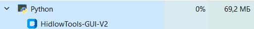
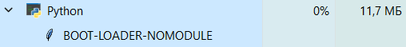
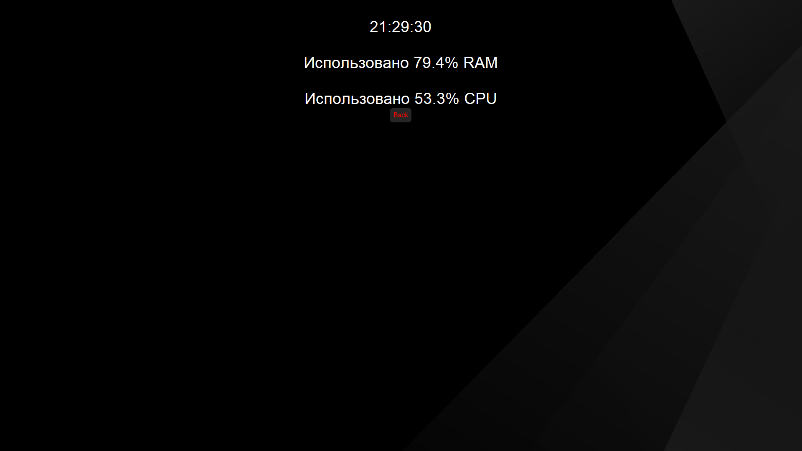
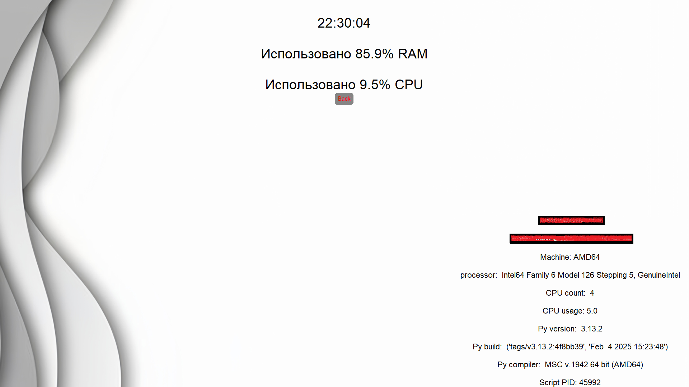
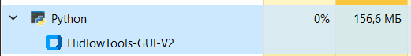

## 27.12.2025
**скоро дроп**
***
## 21.12.20225
* **полностью переписан фронтед. Теперь фон сливается и не конфликтует с цветом фреймов, а так же теперь выглядит как системный ctk**
* **скрипт оптимизирован в 2 раза (30мб ram)**
* **убран tk.Text (Наконец-то) и заменен на ctk.CTkTextbox абсолютно везде.**
* **переписана архитектура создания кнопок**
***
## 15.12.2025
* **troll теперь в GUI**

* **подробное описание в help**

* **улучшено ctypes**

* **улучшена функция gpt chc**

* **исправлен баг при котором конфиги Monitoring_Frame и Monitoring_frame_stat не возвращали свой цвет после белого фона.**

* **вырезан psutil.cpu_percent(), и вместо него добавлен script PID**

* **убран импорт модуля pingapi_func в начале**

* **оптимизирован HidlowAPI (Flask) до базовых 60мб ram**

***
## 10.12.2025
**1. Оптимизирована работа GUI (70mb ram) и boottraper (11,8 mb)**

***
## 09.12.2025
**1. оптимизирован debugconsole & pingapi_func | 130mb ram -> 18.5mb ram**

**2. Удалена синяя тема для лучшей оптимизации**
**3. Обновлена функция ``monitoring`` и теперь совместима с белой темой**

***

## 07.12.2025
**1. Функция ``Monitor`` (Alpha-version) - выводит на экран % загруженности ``RAM``, ``CPU`` и ``актуальное время``. Работает по принципу ``диспечера задач``**

**2. ``Оптимизация GUI`` - раньше скрипт потреблял до 250mb ram. сейчас скрипт потребляет от 150mb до 200mb**

