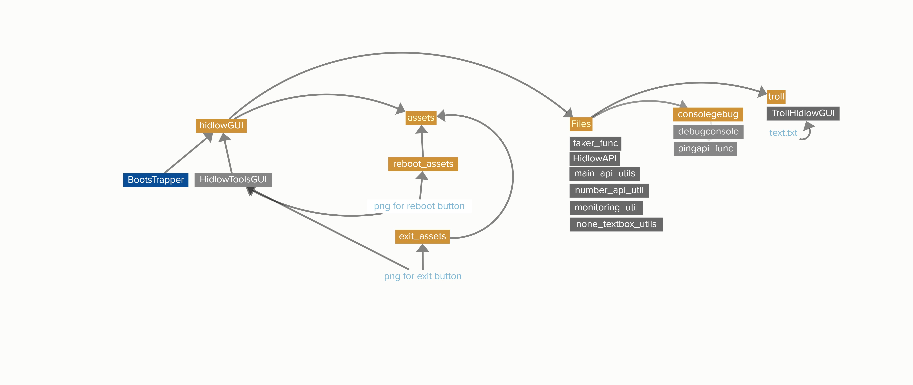

# Documentation


***
[О проекте](#о-проекте) | [Функционал](#функционал) | [Bootstrapper](#bootstrapper) | [Архитектура проекта](#архитектура-проекта) | [Установка](#установка)

***

## О проекте
**HidlowToolsGUI - это проект с набором разных утилит, начиниая от вывода информации о системе, заканчивая выводом информации о номере телефона, ip и координат**

**HidlowToolsGUI.py является ``main-файлом``, который создает ``основной графический интерфейс`` и запускает ``утилиты``. Через него проходит практически все.**
**В нем хранится структура для самого графического интерфейса, а так же блоки кода для запуска всех утилит.**  

**В нем НЕ хранится логика утилит, а лишь их запуск.**
>**Модули импортируются только когда запускается нужная утилита, тем самым оптимизируя скрипт до ~20% ram**


***
## Функционал
**В проекте присутствует 15 утилит и 6 функций**.  
**Утилиты:**
1. **``Number`` - функция, с помощью которой вы можете узнать информацию о мобильном номере телефона.
Использует один из [htmlweb API](https://htmlweb.ru) и выводит более 16 строк с информацией.**


2. **``IP`` - функция, с помощью которой вы можете узнать информацию о IP.  
использует [whois API](https://ipwhois.app) и выводит более 22 строк с информацией**  


3. **``Lat/Lon`` - функция, с помощью которой вы можете узнать информацию о координатах по долготе(_lat_) и широте(_lon_).  
Использует [openstreetmap API](https://nominatim.openstreetmap.org) и выводит более 16 строк с информацией**


4. **``Currency`` - показывает текущий курс ``BTC`` и ``TON``.  
Использует [Coinpaprika API](https://api.coinpaprika.com) и выводит курс в ``RUB`` & ``USD``**


5. **``Troll`` - GUI скрипт, который печатает за вас огромное кол-во текста.
Используется в основном для троллинга, сами фразы берет из ``text.txt``. В настройках можно указать скорость текста**


6. **``API (FlaskAPI)`` - отдельный скрипт, с помощью которого вы можете запустить свой ``API сервер``  
подробно по ссылке: [HidlowAPI](https://github.com/hiikikomorii/API-Server)**


7. **``GPT CHC`` - GPT Chat History Converter.  
Когда вы экспортируете чаты из ``ChatGPT``, вы получаете ``zip-файл``, в котором находится ``conversations.json`` - это ваша история чатов.
Скрипт конвертирует этот файл в .txt для удобного чтения.**
**Поместите .json файл в ту же директорию, что и ``HidlowToolsGUI.py``, 
затем запустите функцию и введите название чата в консоль. После конвертации в той же директории появится ``chat_export.txt``.**


8. **``Faker`` - популярная библиотека для вывода фейковых данных.  
имеет в себе следующие языки: ``Russian`` ``English`` ``Spanish`` ``Japanese``**


9. ``Ctypes Notif`` - создает оконное уведомление используя ``ctypes``
подробно по ссылке: [Windows-notifications](https://github.com/hiikikomorii/Windows-notifications)**


10. **``Monitoring`` - выводит на экран % загруженности ``RAM``, ``CPU`` и ``актуальное время``. Работает по принципу ``диспечера задач``.
Также выводит информацию о системе и самом скрипте.**

написал 15 утилит, потому что учитывал faker как за 4 утилиты, и currency за 2 утилиты

**Консольные команды:**
1. **``Console`` - консоль-отладка, с помощью которой можно вызывать следующие комманды:**
* **``clear`` - очищает консоль**
* **``info`` - выводит ``информацию о системе``**
* **``myip`` - выводит ``ipv4`` и ``локальный ip``**
* **``help`` - список комманд**
* **``time`` - актуальная ``дата`` и ``время``**
* **``exit`` - выход**
* **``reboot`` - перезагрузка скрипта**
* **``fg blue`` - меняет цвет консоли на ``синий``**
* **``fg cyan`` - меняет цвет консоли на ``голубой``**
* **``fg red`` - меняет цвет консоли на ``красный``**
* **``fg white`` - меняет цвет консоли на ``белый``**
* **``ping number`` - проверяет ``Number API`` на работоспособность**
* **``ping ip`` - проверяет ``IP API`` на работоспособность**
* **``ping latlon`` - проверяет `` Lat/Lon API`` на работоспособность**
* **``ping btc`` - проверяет ``BTC API`` на работоспособность**
* **``ping ton`` - проверяет ``TON API`` на работоспособность**
* **``ping faker`` - проверяет модуль ``Faker`` и его работоспособность**
* **``ping qrcode`` - проверяет модуль ``qrcode`` и его работоспособность**
* **``ping ctypes`` - проверяет модуль ``ctypes`` на его работоспособность**
* **``ping monitoring`` - проверяет модули ``pygetwindow``, ``psutil`` и их работоспособность**


**Доп.Фунции:**

2. **``info`` - информация о ``проекте`` и список комманд для ``console``**


3. **``Fullscreen`` - меняет разрешение экрана в скрипте на ``полноэкранный``, либо на ``1146x542``**


4. **``Theme`` - смена темы на ``светлую`` или ``темную``**


5. **``Folder`` - открывает ту папку, где находится ``HidlowToolsGUI.py`` (main)**

6. **``Clear cache`` - очищает ``.pyc`` и ``__pycache__`` во всей папке внутри проекта**

[в начало](#documentation)
***

## Bootstrapper
**подробней про ``Bootstrapper`` → [click](https://github.com/hiikikomorii/BootsTrapper)**

**Является кастомным скриптом для ошибки ``ModuleNotFoundError``**

**Возможности:**
1. **``Install`` - устанавливает недостающий модуль**
2. **``Upgrade pip`` - обновляет pip до последней версии**
3. **``Fullscreen`` - вкл/выкл полноэкранный режим**
4. **``Exit`` - выход**
5. **``Reboot`` - перезагружает скрипт, полезно после установки недостающего модуля**
6. **``Theme`` - Меняет тему на ``White``, ``Black``, ``Blue``**

**Bootstrapper стоит на всех ``.py`` файлах как предохранитель для того, чтобы скрипты ``не крашились``, а выдавали ``GUI-меню`` с удобным способом установки.**

[в начало](#documentation)
***

## Архитектура проекта

визуализация архитектуры: [click](#documentation)  
Оригинальная визуализация на сайте: [click](https://embed.kumu.io/3adadc925b8575fcf573b000781a702d)

**``HidlowGUI/``:**
* **``HidlowToolsGUI.py`` - main-файл, в котором происходит запуск утилит. Подробно написанно в [начале](#о-проекте)**
* **``Bootstrapper.py`` - предохранитель на случай ошибки ``ModuleNotFoundError``. Подробно написанно в [bootstrapper](#bootstrapper)**

**``HidlowGUI/assets/``:**

**тут собраны ``png-кнопки`` для ``exit`` и ``reboot`` в ``HidlowToolsGUI``**

**``HidlowGUI/files/``:**

**Тут лежат все утилиты, которые вызываются в ``main``**
* **``faker_func`` - модуль, в котором лежат все 4 функции Faker**


* **``hidlowAPI`` - отдельный скрипт, запускается через ``subprocess`` и НЕ является модулем.**


* **``monitoring_util`` - модуль, который запускает утилиту ``Monitoring``**


* **``main_api_utils`` - модуль, в котором собранны все утилиты которые взаимодействуют с ``requests``, 
такие как ``currency``, ``ip`` и ``lat/lon``**


* **``number_api_util`` - модуль, который является отдельным от ``main_api_utils`` из-за своего размера на 1 утилиту (131 строка)**


* **``none_textbox_utils`` - модуль, который похож на ``main_api_utils``, но отличается тем, что в нем собранны утилиты, которые не используют ``CTkTextbox``,
но взаимодействуют с ``entry``: ``qrcode``, ``gpthch``, ``ctypes notif``**

**``HidlowGUI/files/consoledebug/``:**

**Тут лежит ``console`` и модуль ``pingapi_func`` для console**

**``HidlowGUI/files/troll``:**

**Тут лежит скрипт ``trollhidlowGUI`` и его зависимость ``text.txt``**


[в начало](#documentation)
***

## Установка

**Для начала скачиваем этот репозиторий ``HidlowToolsGui-main``. Извлекаем эту папку, затем открываем ``cmd`` (``win+r`` → ``cmd``)**

**Затем, устанавливаем ``зависимости`` (pip):**
```bash
cd C:\Users\User\Downloads\hidlowToolsGUI-main\documentation
pip install -r requirements.txt
```
**важно вписать путь прямо во внуть папки ``documentation``.**  
**``pip install -r requirements.txt`` нужен для того, чтобы установить все нужные модули за один раз. Полный список:**
* **``pip install customtkinter``**
* **``pip install requests``**
* **``pip install Pillow``**
* **``pip install colorama``**
* **``pip install qrcode``**
* **``pip install psutil``**
* **``pip install phonenumbers``**
* **``pip install Faker``**
* **``pip install pynput``**
* **``pip install Flask``**
* **``pip install pygetwindow``**

Теперь перемещаемся в папку ``HidlowGUI`` и желательно сначала запустить ``bootstrapper`` для проверки на целостность всех модулей:**

```bash
cd ../hidlowgui
py boot_loader.py
```

**или**

```bash
cd ../hidlowgui
python boot_loader.py
```

**bootstrapper займет на проверку всего пару секунд, затем, если не обнаружит ошибок в модулях, то запустит HidlowToolsGUI и сам закроется.**

**Запуск HidlowToolsGUI напрямую:**

```bash
cd hidlowgui
py HidlowToolsGUI.py
```

**или**

```bash
cd hidlowgui
python HidlowToolsGUI.py
```

[в начало](#documentation)


